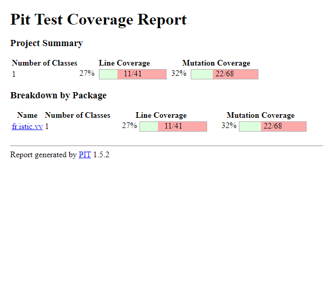
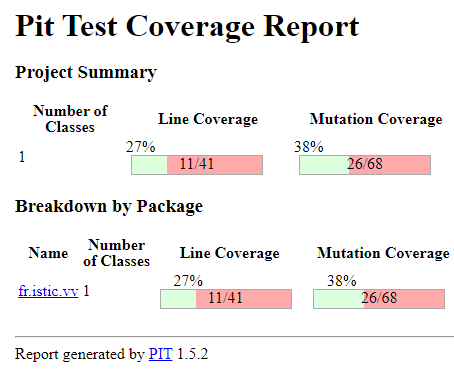
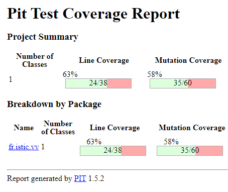
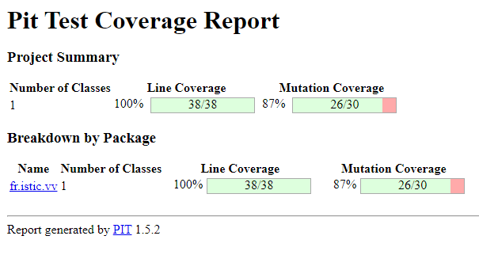

# Test the Date class

Implement a class `Date` with the interface shown below:

```java
class Date implements Comparable<Date> {

    public Date(int day, int month, int year) { ... }

    public static boolean isValidDate(int day, int month, int year) { ... }

    public static boolean isLeapYear(int year) { ... }

    public Date nextDate() { ... }

    public Date previousDate { ... }

    public int compareTo(Date other) { ... }

}
```

The constructor throws an exception if the three given integers do not form a valid date.

`isValidDate` returns `true` if the three integers form a valid year, otherwise `false`.

`isLeapYear` says if the given integer is a leap year.

`nextDate` returns a new `Date` instance representing the date of the following day.

`previousDate` returns a new `Date` instance representing the date of the previous day.

`compareTo` follows the `Comparable` convention:

* `date.compareTo(other)` returns a positive integer if `date` is posterior to `other`
* `date.compareTo(other)` returns a negative integer if `date` is anterior to `other`
* `date.compareTo(other)` returns `0` if `date` and `other` represent the same date.
* the method throws a `NullPointerException` if `other` is `null` 

Design and implement a test suite for this `Date` class.
You may use the test cases discussed in classes as a starting point. 
Also, feel free to add any extra method you may need to the `Date` class.


Use the following steps to design the test suite:

1. With the help of *Input Space Partitioning* design a set of initial test inputs for each method. Write below the characteristics and blocks you identified for each method. Specify which characteristics are common to more than one method.
2. Evaluate the statement coverage of the test cases designed in the previous step. If needed, add new test cases to increase the coverage. Describe below what you did in this step.
3. If you have in your code any predicate that uses more than two boolean operators check if the test cases written to far satisfy *Base Choice Coverage*. If needed add new test cases. Describe below how you evaluated the logic coverage and the new test cases you added.
4. Use PIT to evaluate the test suite you have so far. Describe below the mutation score and the live mutants. Add new test cases or refactor the existing ones to achieve a high mutation score.

Use the project in [tp3-date](../code/tp3-date) to complete this exercise.

## Answer

You can find the associated code in the code repository.

Please note that for this exercise, we will not detail the answer as we processed the same method on the previous exercise.

### 1. Input Space Partionning to design an Initial set of inputs

Values for the isValidDate method.

|       | B1           | B2           | B3                                                             | B4                                        | B5         | B6            |
|-------|--------------|--------------|----------------------------------------------------------------|-------------------------------------------|------------|---------------|
| year  | < 0          | = 0 // error | Leap Year                                                      | Common Year                               |            |               |                                                                                                                                                                |
| month | < 0 // error |              | 0 January, 2 March,4 Mai,6 July,7 August,9 October,11 December | 3 April, 5 June, 8 September, 10 November | 1 February | > 12 // error |
| day   | < 0 // error | = 0 // error | Between 1 and the max of the month                             | Superior of the max of the month          |            |               |

### 2. Statement Coverage

By implementing those tests and analyze them with PITest, we obtain this score.



It is not a lot, but we can improve it by testing other methods.

- Values for the isLeapYear method.

|       | B1    | B2    | B3  | B4    | 
|-------|-------|-------|-----|-------|
| year  | / 400 | / 100 | / 4 | other |                                                                                                                                                                



We improved the result, but not by a lot. This is normal as there is not a lot of cases.

- Values for the compareTo method.

|       | B1                         | B2                         | B3           | B4        | 
|-------|----------------------------|----------------------------|--------------|-----------|
| year  | Date inferior by its year  | Date superior by its year  |              |           |
| month | Date inferior by its month | Date superior by its month |              |           |
| day   | Date inferior by its day   | Date superior by its day   | equals dates | date null |



Way better, but there is 2 method left, so it can be improved.

- Values for the previousDate and nextDate methods (it is the same but reversed)

|              | B1                           | B2                           | B3                          | B4                            | 
|--------------|------------------------------|------------------------------|-----------------------------|-------------------------------|
| nextDate     | day < max day of the month   | day = max day of the month   | day = max day of the year   | day = max day of the year -1  |
| previousDate | day > first day of the month | day = first day of the month | day = first day of the year | day = first day of the year 1 |


Finally, a great coverage. There are still 3 mutants alive that could be killed during the test suite. But since we have over 80% of coverage, we can accept that it is enough.

Then we changed a bit the code in the Date class :

```java
//old
int maxPreviousMonth = getMaxMonth(getMonth() - 1, getYear());
return new Date(maxPreviousMonth, getMonth() - 1, getYear());

//new
int month = getMonth() - 1;
int maxPreviousMonth = getMaxMonth(month, getYear());
return new Date(maxPreviousMonth, month, getYear());
```

It killed one mutant.

And finally we added one test on the constructor just in order to test if we provide a wrong date, it throws an assertion.

So by doing these little tweaks, we arrive with this final coverage.



### 3. Verification of the _Base Choice Coverage_

As we do not have a predicate that uses more than two boolean operators, we do not need to process this step.

### 4. Verifaction of our test suite with PiTest

See below our displayed results on the step 2.